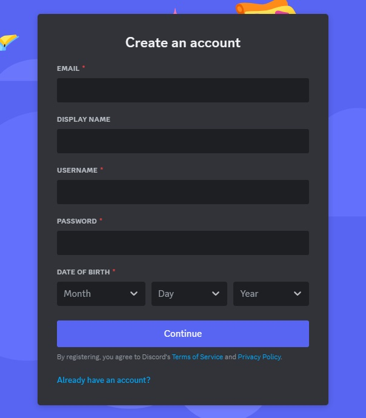

# Discord-Bot-Python
 Basic Discord bot written in Python
1. Make Discord account if you don't have one already.
<!-- links -->
>> [Discord - Register a new account](discord.com/register)
<!--Images-->

