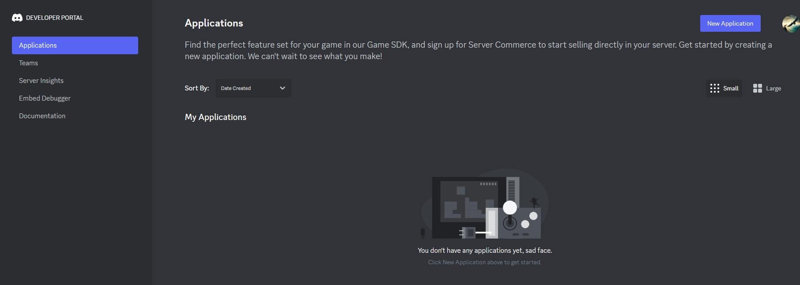
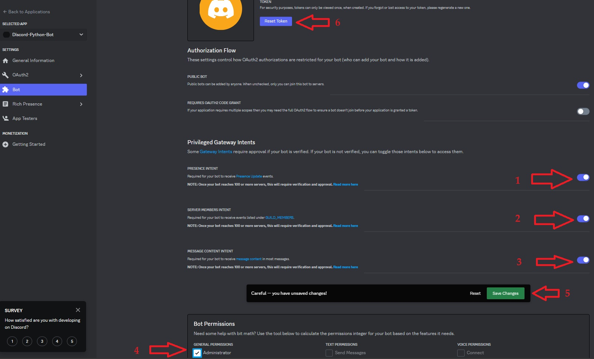
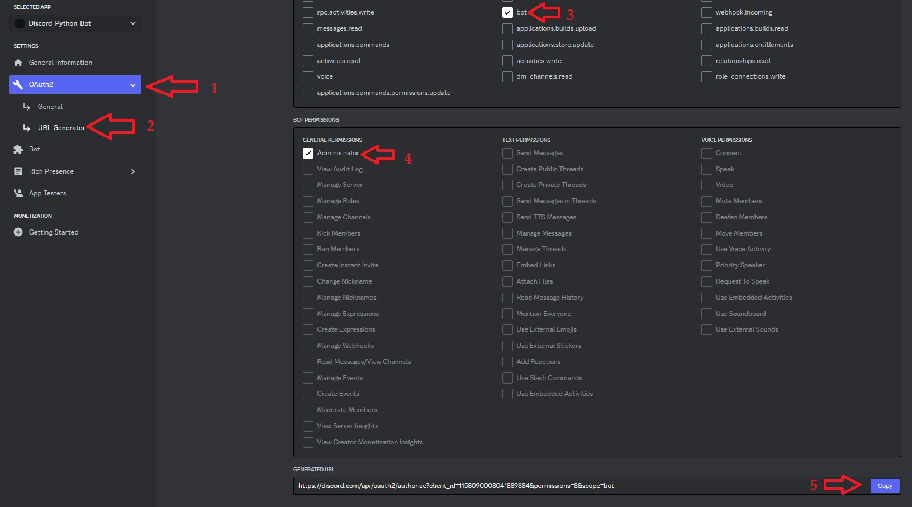

<base target="_blank">

# Discord-Bot-Python
 Basic Discord bot written in Python
* Make Discord account if you don't have one already.
<!-- links -->
>> [Discord - Register a new account](https://discord.com/register)
<!--Images-->

* Goto to the Discord Developer Portal and click ***New Application***
<!-- links -->
>> [Discord - Developer Portal](https://discord.com/developers/applications)
<!--Images-->

* NAME your bot, Check the box and click ***Create***
<!--Images-->

* Click ***Bot*** on the left
    1. PRESENCE INTENT (toggle on)
    2. SERVERS MEMBERS INTENT (toggle on)
    3. MESSAGE CONTENT INTENT (toggle on)
    4. Administrator (check box)
    5. Save Changes
    6. Reset Token
<!--Images-->

* Click ***Yes, do it!***
<!--Images-->

* in a Terminal window
<!-- Bash script block -->
```bash
mkdir MyPythonBot
cd MyPythonBot/
touch requirements.txt
touch .env
touch bot.py
nano.env
```
* In the Discord Developer Portal click ***Copy*** to copy your bot's private TOKEN (always keep this private)
<!--Images-->

* back in the terminal (nano still open)
```
TOKEN=<paste your copied token here>
```
* In the Discord Developer Portal
    1. click ***OAuth2***
    2. click ***URL Generator***
    3. click ***bot***
    4. click ***Administrator***
    5. click ***Copy***
<!--Images-->

* back in the terminal (nano still open)
```
TOKEN=<paste your copied token here>
INVITE_URL=<paste the copied URL here>
```


